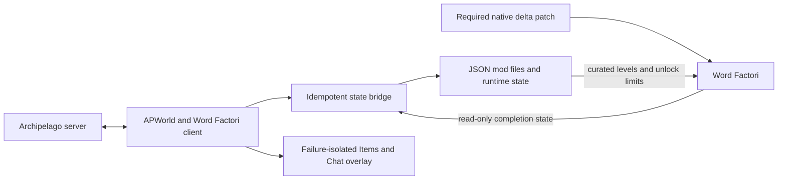

# Word Factori Archipelago

[](https://github.com/Akamarus/word-factori-archipelago/actions/workflows/verify.yml)

An experimental public beta for playing **Word Factori** with [Archipelago](https://archipelago.gg/). It assembles a curated 30- or 40-level custom campaign into seed-specific six-level pages, turns completed levels into Archipelago checks, and unlocks factory machinery as items arrive from the multiworld.


## New in 1.4.0: machine-only progression

The main branch contains the **1.4.0 development candidate**, not a new packaged release.

- **No World Access items in new seeds.** Your machines and recipe requirements determine which puzzles you can solve, alongside page progression.
- **I stays available in every level.** Discovery Labs still restrict machine types, and challenge factories retain their machine limits.
- **Shuffled pages from the start.** The first page is randomized, all six levels on an unlocked page are selectable, and four completions advance. New machines apply when you return to Levels and re-enter a factory, without restarting the game.
- **Start a new room and empty mod save.** Old rooms are no longer supported. Updating the client does not convert them.

There is one integration: enhanced, shuffled, machine-only progression. The player package includes the APWorld, JSON mod, and required reversible native delta patch. There are no integration-mode or fixed-layout choices. Live acceptance remains pending, and in-game missing-machine notices are still planned.

The native patch enables independent first-page buttons and machine refresh on factory entry. It requires your own exact supported copy of the game. The integration does not write Word Factori saves or distribute full game binaries, encoded recipes, or proprietary fonts. See [native integration and playtest details](docs/enhanced-playtest.md) for the technical scope and outstanding acceptance work.

## Engineering highlights

- Python Archipelago APWorld and client integration compatible with Archipelago 0.6.7.
- Word Factori JSON mod integration with a required exact-build native patch and stable 30- and 40-location Archipelago identities even when their native game slots move.
- Deterministic recipe-graph and progression modeling for automated reachability rules.
- Idempotent item delivery, completed-check, reconnect, and victory reconciliation.
- Defensive save-slot binding and digest-verified campaign identity without writing game saves.
- Transactional Windows install, update, and uninstall that preserve neighboring files.
- Failure-isolated, Word Factori-styled Items/Chat overlay with the regular client as fallback.
- A reproducible player package, full automated suite, release verifier, and Windows CI workflow.

## Architecture



The APWorld defines seed logic and stable IDs. The client reconciles authoritative Archipelago state with read-only game completion data, then writes this integration's mod JSON and runtime state. The installer applies the required native patch; the client verifies it before use. The optional overlay presents the same client state without becoming part of progression correctness.

## What the randomizer does

The integration separates **what you build** from **what Archipelago gives you**:

1. The seed selects a bundled, curated set of 30 or 40 word factories and shuffles them into six-level pages, including the first page.
2. Completing a level reports that level as an Archipelago location check.
3. Archipelago sends the item placed at that location to its recipient.
4. Received Word Factori items unlock machines; complete any four levels on a full page to open the next page, starting with page one.
5. The client writes the supported mod files `levels.json` and `archipelago_campaign.json`, plus integration-owned sidecars; Word Factori save files remain read-only. Unreceived machines are disabled, but I is never removed by progression in new seeds.

Letters are always manufactured inside Word Factori. Archipelago never sends individual letters, puzzle layouts, or unverified save values.

## Requirements

- Word Factori on Steam
- Archipelago **0.6.7**
- Windows

The required Word Factori depot is Steam build **12616577**, with the exact original `data.win` verified by the installer. Other builds and other binary modifications are rejected.

Generate a **new room** with the matching 1.4.0 APWorld and client and use a **fresh empty mod save**. Old rooms are unsupported by this candidate, including earlier development rooms with a different progression contract. Updating does not convert an existing seed or save.

## Simple installation

1. Obtain **word-factori-archipelago-1.4.0.zip**, the single player package for this development candidate. This candidate has not been published yet.
2. Extract the ZIP to a normal folder.
3. Close Word Factori and Archipelago.
4. Double-click the root **Install Word Factori Archipelago.cmd**. It installs the APWorld and mod, verifies your game, backs up the original game data, and applies the required native delta patch. If prompted, select `data.win` in your Steam Word Factori installation (Steam → Manage → Browse local files).
5. Restart Archipelago, generate a new room, and connect the Word Factori Client as described below.
6. Start Word Factori, select the **word factori archipelago** mod, and use an **empty save slot**.

For an update, close the game and Archipelago and double-click the same installer again. It keeps the previous integration files as backups. Advanced users can run the equivalent command:

```powershell
powershell -ExecutionPolicy Bypass -File .\install.ps1 -Force
```

To restore the original game and remove the installed APWorld and mod (keeping saves and backups), run:

```powershell
powershell -ExecutionPolicy Bypass -File .\install.ps1 -Uninstall
```

The installer manages these integration-owned paths:

- `%ProgramData%\Archipelago\custom_worlds\word_factori.apworld`
- `%LOCALAPPDATA%\factori\mods\word factori archipelago`

It also patches the verified game's `data.win`, preserving the original as `data.wf-ap-original.win` beside it. The game must be closed for installation, update, or restoration. Unknown builds, conflicting binary modifications, and damaged patch data are rejected.

To restore the game binary, close Word Factori and double-click the root **Restore Original Game.cmd**. This restores the verified original game and keeps saves and the backup. It does **not** uninstall the Archipelago integration. The integration requires its native patch to play; after restoring, run the main installer before using it again.

## Starting a randomized game

1. Copy one of the example player files into your Archipelago `Players` folder:
   - `examples/WordFactori.yaml` for the normal Campaign Count goal.
   - `examples/WordFactoriTarget.yaml` for the Final Factory goal.
2. Change the player `name` and any Word Factori options you want. Keep `custom_level_set: discovery_labs` for all 40 levels, or choose `core_campaign` for the focused 30-level set. Every room uses enhanced, shuffled, machine-only progression; the examples have no mode or layout selector.
3. Generate and host the room normally with Archipelago.
4. Launch **Word Factori Client** from the Archipelago Launcher. Connect from the in-game AP panel, through the regular client, or with an `archipelago://` launch link.
5. Start Word Factori, select the Archipelago mod, and enter a new empty mod save slot.
6. Choose freely among the six levels on the first page. Complete any four to open the next page, and use the same rule on later full pages. When a machine arrives, return to **Levels** and enter a factory to apply it. An already-open factory is not rebuilt; no game restart or save reload is needed for each item. Stickers never require a reload.

Connect the Archipelago client **before** completing checks. An existing progressed slot is deliberately rejected until it has already been bound to that room.

## Checks and locations

The selected custom level set determines whether the seed has 30 or 40 stable locations:

| Group | Count | What counts as a check |
|---|---:|---|
| Standard factories | 26 | Complete the target word |
| Challenge factories | 3 | Complete CAT, BOOK, or PHONE with curated machine limits |
| Final factory | 1 | Complete PITCHFORK |
| Discovery Labs | 10 | Produce C, V, M, W, U, J, X, E, H, or R using the lab's declared machine route |

The 30 canonical Core Campaign identities and ten Discovery Lab identities form the 40-level set. Labs and campaign factories may move to different eligible pages in the shuffled layout. The client assembles the room's selected bundled manifest and exact layout when it connects. Arbitrary Workshop levels are never silently imported into an AP seed.

The game save records the level's native slot, while Archipelago continues to identify the check by its canonical stable key and location ID. The client translates between those identities, so moving a level does not change its check. Machine restrictions use JSON limits, not renamed or renumbered checks.

## Items and unlocks

| Item | Effect |
|---|---|
| Bender Access | Available from the start; enables bending |
| Rotation Access | Enables clockwise and counterclockwise rotation |
| Reflection Access | Enables horizontal and vertical reflection |
| Merger2 Access | Enables the two-input merger |
| Merger3 Access | Enables the three-input merger |
| Merger4 Access | Enables the four-input merger |
| Sticker items | Filler messages; they do not write to Word Factori's sticker save state |

Received packets are keyed by Archipelago receive-sequence number. Replayed packets do not grant extra copies, and a reconnect rebuilds the current unlock state from authoritative server data.

## Goals

Two goal modes are available:

- **Campaign Count**: complete a configurable number of the 30 canonical non-Discovery campaign locations, wherever they appear in the layout. The default is 25; the supported range is 20–30.
- **Final Factory**: complete `PITCHFORK — Final Factory`.

Discovery Labs do not count toward Campaign Count.

## How the logic stays solvable

Word Factori recipes form a deterministic graph. The project reads the locally installed `recipes.data` only during development verification, then calculates which combinations of machine capabilities can produce every required letter. Only the resulting capability names are stored in this repository.

New-seed Archipelago reachability combines machine and page rules:

1. The player must own at least one valid machine set for the target.
2. Each page after the first requires four reachable locations on the preceding page, with no prerequisites between levels on the same page. The first page also has six independently selectable levels and a four-completion threshold.

There are no World Access requirements. Region names group puzzles only.

The first page shuffles I and C, two other early-solvable starters, and two later targets to revisit. Archipelago fill is asked to place one local-early Merger2 Access and one local-early Rotation Access; together with the starting Bender, these make at least four first-page levels solvable. Every full page keeps at least three distinct unavoidable machine profiles. Reflection, Merger3, and Merger4 remain unavoidable for at most three checks per full page. Rotation follows the same cap except that one later Core Campaign page may contain four Rotation-unavoidable checks; no page may exceed four. Later pages may still be Merger2-heavy, and Archipelago fill is responsible for placing the items needed by the four-check frontier.

Only four checks on each full page are needed for forward progress, starting on page one. The other two remain valid checks and can be deferred, completed after more machinery arrives, or revisited for a goal or item without blocking the next-page arrow.

Discovery Labs use stricter rules: only their declared route is permitted in the generated level. Challenge levels keep their curated quantity limits even after all relevant machine families are unlocked.

For example, the M Lab needs Merger3, J needs Bender and Merger2, and X needs Merger2 and Reflection. Owning Rotation does not enable it inside a lab that forbids it. I remains available in all these labs in new seeds. An in-game missing-requirement notice is still planned, not implemented by this progression update.


## Save safety

Word Factori stores custom-campaign progress separately from its base campaign. The client reads:

- `%LOCALAPPDATA%\factori\user_ref.json`
- `%LOCALAPPDATA%\factori\mods.json`
- the active account's `mods\word factori archipelago\save.json`

These save and selection files are read-only to the integration. The client writes only integration-owned files:

- the installed mod's `levels.json`, `archipelago_campaign.json`, and `archipelago_runtime.json`; and
- an idempotency sidecar under `%LOCALAPPDATA%\factori\archipelago`.

The installer separately modifies the verified game binary and preserves its original backup; it does not edit game saves.

Each Archipelago room binds to the active empty Word Factori slot using that slot's stable `random_id`. A slot with previous completions is not auto-bound, and switching slots pauses check submission. This prevents unrelated progress from becoming false checks.

Every curated set has an ID, version, stable level keys, and content digest. The client installs only a bundled set whose digest exactly matches the room. If the room and installed mod do not match, both automatic and manual reporting stop.

## Client commands

| Command | Purpose |
|---|---|
| `/wf_status` | Show mod selection, campaign compatibility, save binding, deliveries, and bridge status |
| `/wf_scan` | Explicitly scan the active save once when automatic mod-selection detection is unavailable |
| `/wf_complete 31` | Manually report location 31 by one-based number |
| `/wf_complete "Discover C — Bending Lab"` | Manually report a uniquely named location |
| `/wf_overlay status` | Show the item overlay's availability and state |
| `/wf_overlay show` | Open the item ledger |
| `/wf_overlay hide` | Close the item ledger |
| `/wf_overlay restart` | Restart the optional renderer if it stopped |

Manual reporting cannot bypass campaign-digest or save-slot safety checks.

## In-game Archipelago client

While Word Factori is focused, received Archipelago items appear as blue popups on the left side of the game. The small **AP MAIL** button shows unread deliveries; click it or press **F8** to open the integrated client.

The panel provides:

- **Items** with All, Received, and Sent history;
- **Chat** with player messages, hints, command results, and safe error notices;
- manual server address and slot connection, intentional disconnect, and connection status;
- masked room-password entry; and
- normal Archipelago chat, `!` server commands, and `/` local commands from one input.

Enter sends text. Shift+Enter inserts a line break. Escape, F8, outside click, game focus loss, or closing the panel releases keyboard focus and clears unsubmitted passwords. The standard Word Factori Client remains the fallback if the renderer cannot start.

The overlay is cosmetic and failure-isolated: if it cannot start, the regular client continues working and retains the complete item history. Windowed and borderless modes are supported. Exclusive fullscreen may hide the overlay; use borderless mode or the regular client in that case.

Sticker deliveries and reconnecting to the same room do not require reloading Word Factori. Received machines apply after returning to Levels and entering a factory. They do not change an already-open factory.

## Troubleshooting

### A machine arrived but is not visible

Return to **Levels** and enter a factory. The native patch refreshes machine availability on factory entry; it does not rebuild an already-open factory. No game restart or save reload is needed per item. If the machine is still unavailable, check `/wf_status` and confirm that the factory's lab or challenge rules permit it.

### A level is visible but cannot be completed

Run `/wf_status`. A target may need a machine you have not received, or its lab may forbid another machine you own. I is always available and World Access is not required.

### The client refuses to bind the save

Use a new empty save slot for that Archipelago room. The safety system intentionally rejects an unbound slot that already contains completions.

### The in-game client is missing

Use `/wf_overlay status` in the Word Factori Client. Then try `/wf_overlay restart`. Keep Word Factori in windowed or borderless mode; exclusive fullscreen is not supported. Item delivery and check reporting continue in the regular client even when the display is unavailable.

### The next-page arrow is gray

Complete any four levels on the current full page, including page one. If the threshold is met and the arrow remains gray, check `/wf_status` for the room/campaign identity and native patch status. Use a new room generated with the current APWorld and a fresh empty save; old rooms are unsupported.

## Current limitations

- Version 1.4.0 is a local development candidate; machine-only progression still needs live acceptance.
- Arbitrary Workshop packs are not imported into generated seeds.
- Progressive machine quantities are deferred until a quantity-aware layout solver exists.
- Sticker items are AP filler rather than in-game sticker grants.
- There is no DeathLink, traps, or randomized factory layouts.
- The full in-game client is implemented. Its primary Windows 10/125%/2560×1440 path is live-smoke tested; password-room, 100%/150% scaling, ultrawide, and multi-monitor permutations remain in the beta matrix.
- Exclusive fullscreen is not supported; use windowed or borderless mode.

The required native patch uses the existing compiled delta. Isolated engine tests verify first-page freedom, factory-entry machine refresh, malformed-state fallback, and vanilla isolation; a normal connected in-game playthrough of this candidate is still required before public release. See [native integration and playtest details](docs/enhanced-playtest.md). These earlier isolated results do not establish complete live acceptance of 1.4.0.

## Verification evidence

**Automated and rerunnable:** the Windows verification command builds the APWorld and player ZIP, runs the complete unit/integration suite, and runs manifest, parity, recipe, and sensitive-data checks. GitHub Actions runs the same script on Windows with Python 3.12.

**Recorded earlier acceptance:** the pre-1.3 client and overlay path was exercised on Windows 10 at 2560×1440 and 125% scaling with Word Factori Steam build 12616577. That evidence does not establish live acceptance of shuffled pages or four-of-six progression. The 1.3.0 acceptance matrix is in the repository's [testing evidence](https://github.com/Akamarus/word-factori-archipelago/tree/main/docs/testing), with live rows marked pending until they are observed.

**Still pending:** password-protected rooms, 100% and 150% scaling, ultrawide, mixed-DPI multi-monitor use, and a second physical machine. Exclusive fullscreen is unsupported; windowed or borderless mode and the regular client fallback are the supported choices.

## Development and verification

From a clean checkout on Windows with Python 3.12 or newer, run the same build, test, and verification sequence used by CI:

```powershell
powershell -ExecutionPolicy Bypass -File .\tools\verify.ps1
```

The script performs these commands in order:

```powershell
py -3 tools\build_release.py
py -3 -m unittest discover -s tests -v
py -3 tools\verify_release.py
```

Building first is required because the installer integration tests exercise the generated `word_factori.apworld`. The verification scope includes deterministic 30/40-level layouts, shuffled first-page and four-of-six progression, stable native-to-canonical mapping, both goals, duplicate deliveries and checks, reconnect reconciliation, campaign identity and mismatch blocking, save-slot selection/binding, installation and restoration, and release hygiene. Internal replay coverage of historical contracts does not promise support for old rooms. Automated results are separate from the pending live acceptance of this candidate.

## Project ownership and attribution

Created and maintained by Jack (@Akamarus). AI tools were used extensively for planning, implementation assistance, documentation, and review. Jack directed the project, made the product and integration decisions, performed live game testing, validated release behavior, and retains responsibility for maintenance and releases.

Code in this repository is available under the [MIT License](LICENSE).

Word Factori is created by Star Garden Games. Archipelago is maintained by the Archipelago community. This is an independent fan integration and is not affiliated with or endorsed by either project.
