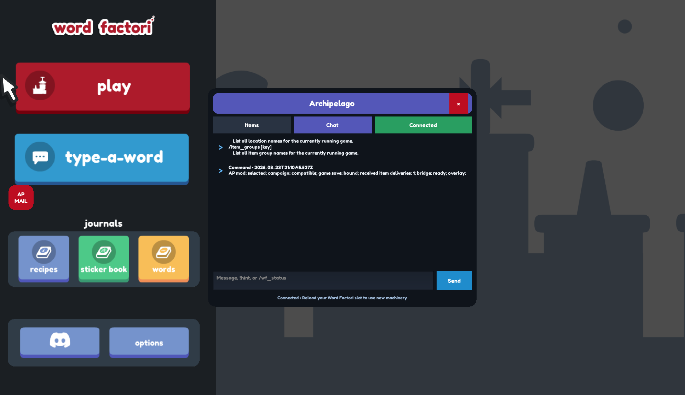
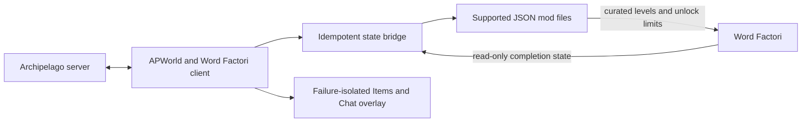
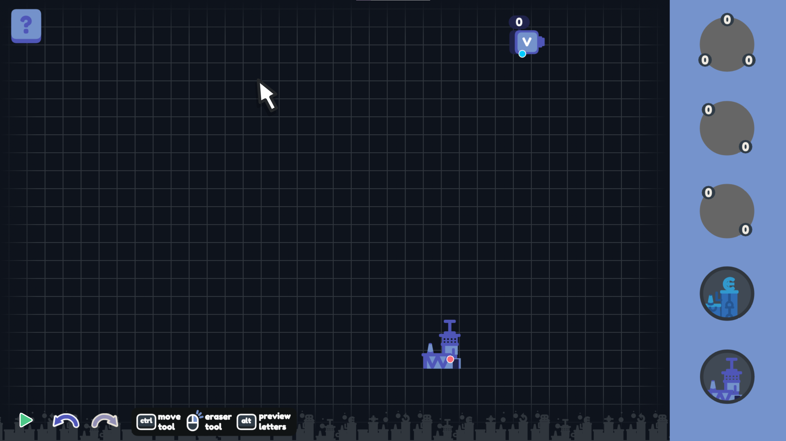

# Word Factori Archipelago

[](https://github.com/Akamarus/word-factori-archipelago/actions/workflows/verify.yml)

An experimental public beta for playing **Word Factori** with [Archipelago](https://archipelago.gg/). It assembles a curated 30- or 40-level custom campaign into seed-specific six-level pages, turns completed levels into Archipelago checks, and unlocks factory machinery as items arrive from the multiworld.



Version 1.4.0 is a local development candidate: new seeds use **machine-only progression**, without World Access items. I is always available; received machines, valid recipes, and page requirements determine what you can complete. In default supported mode, finish I, C, V, L, O, and A in order to open page two. Later unlocked pages offer all six levels; completing any four opens the next page. Enhanced mode also randomizes the first page and uses four completions there. Live acceptance remains pending; this is not a newly published release.

If you tested an earlier unpublished 1.3.0 build that shuffled A onto the first slot, generate a **new room** with this build and use an empty mod save. Those rooms used incorrect native unlock rules and cannot be repaired just by updating the client. Existing 1.2.x rooms retain their original canonical layout and server rules.

The default **supported** mode uses Word Factori's JSON mod format without patching `data.win`. An opt-in [enhanced playtest](docs/enhanced-playtest.md) now adds mixed first-page randomization, independent first-page buttons, and machine refresh on factory entry through a reversible, exact-build native patch. It requires a new enhanced room and the separate playtest package; it is not yet approved for public release. Neither mode writes Word Factori saves or distributes full game binaries, encoded recipes, or proprietary fonts.

## Engineering highlights

- Python Archipelago APWorld and client integration compatible with Archipelago 0.6.7.
- Supported Word Factori JSON mod integration with stable 30- and 40-location Archipelago identities even when their native game slots move.
- Deterministic recipe-graph and progression modeling for automated reachability rules.
- Idempotent item delivery, completed-check, reconnect, and victory reconciliation.
- Defensive save-slot binding and digest-verified campaign identity without writing game saves.
- Transactional Windows install, update, and uninstall that preserve neighboring files.
- Failure-isolated, Word Factori-styled Items/Chat overlay with the regular client as fallback.
- A reproducible player package, full automated suite, release verifier, and Windows CI workflow.

## Architecture



The APWorld defines seed logic and stable IDs. The client reconciles authoritative Archipelago state with read-only game completion data, then rewrites only this integration's supported mod JSON. The optional overlay presents the same client state without becoming part of progression correctness.

## What the randomizer does

The integration separates **what you build** from **what Archipelago gives you**:

1. The seed selects a bundled, curated set of 30 or 40 word factories and normally shuffles them into six-level pages.
2. Completing a level reports that level as an Archipelago location check.
3. Archipelago sends the item placed at that location to its recipient.
4. Received Word Factori items unlock machines; complete any four levels on a full page to open the next page (supported mode requires six for its initial tutorial).
5. The client writes the supported mod files `levels.json` and `archipelago_campaign.json`, plus integration-owned sidecars; Word Factori save files remain read-only. Unreceived machines are disabled, but I is never removed by progression in new seeds.

Letters are always manufactured inside Word Factori. Archipelago never sends individual letters, puzzle layouts, or unverified save values.

## Requirements

- Word Factori on Steam
- Archipelago **0.6.7**
- Windows

The currently tested Word Factori depot is Steam build **12616577**.

Generate machine-only rooms with the 1.4.0 APWorld and client. Existing valid 1.2.x and 1.3.x rooms keep their original layouts and World Access requirements, including input locks. Updating the client does not convert an existing seed. Use a new room and empty mod save for machine-only progression. Older clients reject the new progression contract rather than silently using incorrect rules.

## Simple installation

1. Obtain the matching player ZIP (`word-factori-archipelago-1.4.0.zip` for this development candidate). Published releases are on GitHub; this candidate has not been published yet.
2. Extract the ZIP to a normal folder.
3. Close Word Factori and Archipelago.
4. Double-click **Install Word Factori Archipelago.cmd**.
5. Restart Archipelago and Word Factori.
6. In Word Factori, select the **word factori archipelago** mod and use an **empty save slot**.

For an update, run the installer with `-Force`:

```powershell
powershell -ExecutionPolicy Bypass -File .\install.ps1 -Force
```

To remove only the files owned by this integration, run:

```powershell
powershell -ExecutionPolicy Bypass -File .\install.ps1 -Uninstall
```

The installer replaces only these integration-owned paths:

- `%ProgramData%\Archipelago\custom_worlds\word_factori.apworld`
- `%LOCALAPPDATA%\factori\mods\word factori archipelago`

## Starting a randomized game

1. Copy one of the example player files into your Archipelago `Players` folder:
   - `examples/WordFactori.yaml` for the normal Campaign Count goal.
   - `examples/WordFactoriTarget.yaml` for the Final Factory goal.
2. Change the player `name` and any Word Factori options you want. Keep `custom_level_set: discovery_labs` for all 40 levels, or choose `core_campaign` for the focused 30-level set. The examples select `campaign_layout: shuffled_pages`; choose `fixed_pages` to preserve the canonical order throughout. Both choices use the six-level tutorial followed by four-of-six page unlocking.
3. Generate and host the room normally with Archipelago.
4. Launch **Word Factori Client** from the Archipelago Launcher. Connect from the in-game AP panel, through the regular client, or with an `archipelago://` launch link.
5. Start Word Factori, select the Archipelago mod, and enter a new empty mod save slot.
6. In supported mode, complete **I → C → V → L → O → A** in order. After those six checks, choose freely on unlocked pages; four completions open the next page. When a machine arrives, reselect the mod save or restart Word Factori. In enhanced mode, the first page is also shuffled and needs four completions; received machines apply on factory entry without restarting. Stickers never require a reload.

Connect the Archipelago client **before** completing checks. An existing progressed slot is deliberately rejected until it has already been bound to that room.

## Checks and locations

The selected custom level set determines whether the seed has 30 or 40 stable locations:

| Group | Count | What counts as a check |
|---|---:|---|
| Standard factories | 26 | Complete the target word |
| Challenge factories | 3 | Complete CAT, BOOK, or PHONE with curated machine limits |
| Final factory | 1 | Complete PITCHFORK |
| Discovery Labs | 10 | Produce C, V, M, W, U, J, X, E, H, or R using the lab's declared machine route |

The 30 canonical Core Campaign identities and ten Discovery Lab identities form the 40-level set. With `shuffled_pages`, Labs and campaign factories may move to different eligible pages; with `fixed_pages`, their bundled order is retained. The client assembles the room's selected bundled manifest and exact layout when it connects. Arbitrary Workshop levels are never silently imported into an AP seed.

The game save records the level's native slot, while Archipelago continues to identify the check by its canonical stable key and location ID. The client translates between those identities, so moving a level does not change its check. Machine restrictions use JSON limits, not renamed or renumbered checks.

## Items and unlocks

| Item | Effect |
|---|---|
| Bender Access | Available from the start; enables bending |
| Rotation Access | Enables clockwise and counterclockwise rotation |
| Reflection Access | Enables horizontal and vertical reflection |
| Merger2 Access | Enables the two-input merger |
| Merger3 Access | Enables the three-input merger |
| Merger4 Access | Enables the four-input merger |
| Progressive World Access | Legacy rooms only; absent from new seeds, replaced by five extra stickers |
| Sticker items | Filler messages; they do not write to Word Factori's sticker save state |

Received packets are keyed by Archipelago receive-sequence number. Replayed packets do not grant extra copies, and a reconnect rebuilds the current unlock state from authoritative server data.

## Goals

Two goal modes are available:

- **Campaign Count**: complete a configurable number of the 30 canonical non-Discovery campaign locations, wherever they appear in the layout. The default is 25; the supported range is 20–30.
- **Final Factory**: complete `PITCHFORK — Final Factory`.

Discovery Labs do not count toward Campaign Count.

## How the logic stays solvable

Word Factori recipes form a deterministic graph. The project reads the locally installed `recipes.data` only during development verification, then calculates which combinations of machine capabilities can produce every required letter. Only the resulting capability names are stored in this repository.

New-seed Archipelago reachability combines machine and page rules:

1. The player must own at least one valid machine set for the target.
2. In supported mode, tutorial levels require their immediate predecessor and page two requires all six tutorial locations. Enhanced mode has independent first-page levels and requires four. Each later page requires four reachable locations on the preceding page, with no prerequisites between levels on the same page.

There are no World Access requirements in new seeds. Region names group puzzles only. Old rooms retain their additional tier requirement for compatibility.

In supported mode, the first page stays in the safe native tutorial order. Enhanced mode shuffles it. Later pages vary by seed. Archipelago fill is asked to place one local-early Merger2 Access and one local-early Rotation Access so those mandatory tutorial capabilities cannot lock themselves away. Every full page keeps at least three distinct unavoidable machine profiles. Reflection, Merger3, and Merger4 remain unavoidable for at most three checks per full page. Rotation follows the same cap except that one later Core Campaign page may contain four Rotation-unavoidable checks; no page may exceed four. Later pages may still be Merger2-heavy, and Archipelago fill is responsible for placing the items needed by the four-check frontier.

After the six-check tutorial, only four page checks are needed for forward progress. The other two remain valid checks and can be deferred, completed after more machinery arrives, or revisited for a goal or item without blocking the next-page arrow.

Discovery Labs use stricter rules: only their declared route is permitted in the generated level. Challenge levels keep their curated quantity limits even after all relevant machine families are unlocked.

For example, the M Lab needs Merger3, J needs Bender and Merger2, and X needs Merger2 and Reflection. Owning Rotation does not enable it inside a lab that forbids it. I remains available in all these labs in new seeds. An in-game missing-requirement notice is still planned, not implemented by this progression update.



## Save safety

Word Factori stores custom-campaign progress separately from its base campaign. The client reads:

- `%LOCALAPPDATA%\factori\user_ref.json`
- `%LOCALAPPDATA%\factori\mods.json`
- the active account's `mods\word factori archipelago\save.json`

These files are read-only to the integration. The client writes only:

- the installed mod's `levels.json` and `archipelago_campaign.json`; and
- an idempotency sidecar under `%LOCALAPPDATA%\factori\archipelago`.

Each Archipelago room binds to the active empty Word Factori slot using that slot's stable `random_id`. A slot with previous completions is not auto-bound, and switching slots pauses check submission. This prevents unrelated progress from becoming false checks.

Every curated set has an ID, version, stable level keys, and content digest. The client installs only a bundled set whose digest exactly matches the room. If the room and installed mod do not match, both automatic and manual reporting stop.

## Client commands

| Command | Purpose |
|---|---|
| `/wf_status` | Show mod selection, campaign compatibility, save binding, deliveries, and bridge status |
| `/wf_scan` | Explicitly scan the active save once when automatic mod-selection detection is unavailable |
| `/wf_complete 31` | Manually report location 31 by one-based number |
| `/wf_complete "Discover C — Bending Lab"` | Manually report a uniquely named location |
| `/wf_overlay status` | Show the item overlay's availability and state |
| `/wf_overlay show` | Open the item ledger |
| `/wf_overlay hide` | Close the item ledger |
| `/wf_overlay restart` | Restart the optional renderer if it stopped |

Manual reporting cannot bypass campaign-digest or save-slot safety checks.

## In-game Archipelago client

While Word Factori is focused, received Archipelago items appear as blue popups on the left side of the game. The small **AP MAIL** button shows unread deliveries; click it or press **F8** to open the integrated client.

The panel provides:

- **Items** with All, Received, and Sent history;
- **Chat** with player messages, hints, command results, and safe error notices;
- manual server address and slot connection, intentional disconnect, and connection status;
- masked room-password entry; and
- normal Archipelago chat, `!` server commands, and `/` local commands from one input.

Enter sends text. Shift+Enter inserts a line break. Escape, F8, outside click, game focus loss, or closing the panel releases keyboard focus and clears unsubmitted passwords. The standard Word Factori Client remains the fallback if the renderer cannot start.

The overlay is cosmetic and failure-isolated: if it cannot start, the regular client continues working and retains the complete item history. Windowed and borderless modes are supported. Exclusive fullscreen may hide the overlay; use borderless mode or the regular client in that case.

Sticker deliveries and reconnecting to the same room do not require reloading Word Factori. The client only replaces the generated campaign when a received machine or Progressive World Access item changes what the game should expose.

## Troubleshooting

### A machine or World Access item arrived but is not visible

Return to Word Factori's save selection and reselect the mod slot. If that does not reload the palette or newly available level input, restart Word Factori. Sticker items and ordinary reconnects never need this step. The current game build does not expose a verified live-reload hook for real progression changes.

### A level is visible but cannot be completed

Run `/wf_status`. A target may need a machine you have not received, or its lab may forbid another machine you own. In new rooms, I is always available and World Access is not required. In old rooms only, missing World Access still disables I for tier-locked levels.

### The client refuses to bind the save

Use a new empty save slot for that Archipelago room. The safety system intentionally rejects an unbound slot that already contains completions.

### The in-game client is missing

Use `/wf_overlay status` in the Word Factori Client. Then try `/wf_overlay restart`. Keep Word Factori in windowed or borderless mode; exclusive fullscreen is not supported. Item delivery and check reporting continue in the regular client even when the display is unavailable.

### The next-page arrow is gray

Page two opens only after all six tutorial levels are complete. On later full pages, four completions open the next page. If the correct threshold is met and the arrow remains gray, confirm the room/campaign identity with `/wf_status`, then reselect the mod slot. If your first page is not I, C, V, L, O, A, you are using an earlier invalid beta room and must regenerate it with the current APWorld.

## Current limitations

- Version 1.4.0 is a local development candidate; machine-only progression still needs live acceptance.
- Arbitrary Workshop packs are not imported into generated seeds.
- Progressive machine quantities are deferred until a quantity-aware layout solver exists.
- Sticker items are AP filler rather than in-game sticker grants.
- There is no DeathLink, traps, or randomized factory layouts.
- The full in-game client is implemented. Its primary Windows 10/125%/2560×1440 path is live-smoke tested; password-room, 100%/150% scaling, ultrawide, and multi-monitor permutations remain in the beta matrix.
- Exclusive fullscreen is not supported; use windowed or borderless mode.

The separate [enhanced playtest](docs/enhanced-playtest.md) includes the optional native patch, matching client, and reversible installer. Isolated engine tests verify first-page freedom, factory-entry machine refresh, malformed-state fallback, and vanilla isolation; a normal connected in-game playthrough is still required before public release. In enhanced mode, return to Levels and enter a factory to apply received items—no save reload per item. The default supported mode still requires reselecting the AP save after machine or world unlocks.

## Verification evidence

**Automated and rerunnable:** the Windows verification command builds the APWorld and player ZIP, runs the complete unit/integration suite, and runs manifest, parity, recipe, and sensitive-data checks. GitHub Actions runs the same script on Windows with Python 3.12.

**Recorded earlier acceptance:** the pre-1.3 client and overlay path was exercised on Windows 10 at 2560×1440 and 125% scaling with Word Factori Steam build 12616577. That evidence does not establish live acceptance of shuffled pages or four-of-six progression. The 1.3.0 acceptance matrix is in the repository's [testing evidence](https://github.com/Akamarus/word-factori-archipelago/tree/main/docs/testing), with live rows marked pending until they are observed.

**Still pending:** password-protected rooms, 100% and 150% scaling, ultrawide, mixed-DPI multi-monitor use, and a second physical machine. Exclusive fullscreen is unsupported; windowed or borderless mode and the regular client fallback are the supported choices.

## Development and verification

From a clean checkout on Windows with Python 3.12 or newer, run the same build, test, and verification sequence used by CI:

```powershell
powershell -ExecutionPolicy Bypass -File .\tools\verify.ps1
```

The script performs these commands in order:

```powershell
py -3 tools\build_release.py
py -3 -m unittest discover -s tests -v
py -3 tools\verify_release.py
```

Building first is required because the installer integration tests exercise the generated `word_factori.apworld`. The test suite covers deterministic 30/40-level layouts, the sequential tutorial and six-then-four progression, stable native-to-canonical mapping, both goals, legacy rooms, duplicate deliveries and checks, reconnect reconciliation, campaign identity and mismatch blocking, save-slot selection/binding, transactional update/uninstall, and release hygiene.

## Project ownership and attribution

Created and maintained by Jack (@Akamarus). AI tools were used extensively for planning, implementation assistance, documentation, and review. Jack directed the project, made the product and integration decisions, performed live game testing, validated release behavior, and retains responsibility for maintenance and releases.

Code in this repository is available under the [MIT License](LICENSE).

Word Factori is created by Star Garden Games. Archipelago is maintained by the Archipelago community. This is an independent fan integration and is not affiliated with or endorsed by either project.
