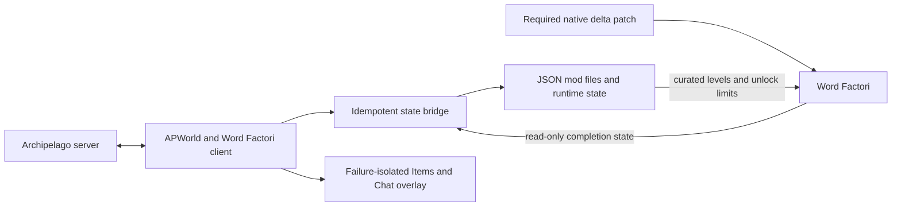

# Word Factori Archipelago

[](https://github.com/Akamarus/word-factori-archipelago/actions/workflows/verify.yml)

An experimental public beta for playing **Word Factori** with [Archipelago](https://archipelago.gg/). It assembles a curated 30- or 40-level custom campaign into seed-specific six-level pages, turns completed levels into Archipelago checks, and unlocks factory machinery as items arrive from the multiworld.


## New in 1.5.1: recipe-loading fix and symbol orders

**[Download the 1.5.1 tester prerelease](https://github.com/Akamarus/word-factori-archipelago/releases/tag/v1.5.1)** — fixes the reproduced save-loading recipe crash, adds static Archipelago groups and supports native symbols in Type-a-Word orders. One player ZIP supports Windows and Linux/Proton. This is **not a stable release**. See the [complete changelog](CHANGELOG.md).

- **Recipe Journal checks:** 187 distinct working letter recipes, enabled by default and configurable.
- **Type-a-Word orders:** optional checks for a seed-selected subset of your own word list.
- **Progressive machines:** optional 1 → 2 → 3 → 4 → unlimited placement allowances, with quantity-aware page selection and live upgrades.
- **Universal Tracker:** reconstructs the actual room's layout, goals, selected words and quantity rules.
- **Native enforcement:** saved/imported factories cannot bypass locked machinery; progressive over-limit layouts stay editable without awarding invalid checks.

**Updating from 1.5.0, an earlier supported release or a development build:** close the game and Archipelago, extract this ZIP into a separate folder, and rerun its installer. Restart Archipelago, update the tracker-side APWorld too, generate a **new room** and use a **fresh empty mod save**. Do not delete your old saves or original-game backup. Old room compatibility is not promised by this release; changing YAML cannot change an existing room.

### YAML options

Options go under `Word Factori:`. See [normal play](examples/WordFactori.yaml), [Final Factory](examples/WordFactoriTarget.yaml), [progressive machines](examples/WordFactoriProgressive.yaml), or [Type-a-Word](examples/WordFactoriWords.yaml) for complete player files.

| Option | Default | Meaning |
|---|---|---|
| `recipe_checks` | `true` | Adds 187 Recipe Journal checks; `false` keeps only factory checks plus any word orders. |
| `type_a_word_checks` | `false` | Enables checks for selected custom word orders. |
| `type_a_word_count` | `5` | Select 1–20 words from your list when enabled. |
| `type_a_word_words` | `[]` | YAML list of up to 200 entries, each 2–12 supported letters/symbols. Quote entries and provide enough unique targets for the count. |
| `progressive_machines` | `false` | Replaces machine unlocks with finite placement upgrades. |
| `start_inventory_from_pool` | `{}` | Optional starting item copies removed from the randomized pool; use item names matching your machine mode. |
| `custom_level_set` | `discovery_labs` | `discovery_labs`: 40 factories; `core_campaign`: 30. |
| `goal` | `campaign_count` | `campaign_count` or `final_factory`. |
| `campaign_count` | `25` | 20–30 canonical campaign completions for the count goal; lab/recipe/word checks do not count. |

Example enabling all three check/progression options:

```yaml
Word Factori:
  custom_level_set: discovery_labs
  goal: campaign_count
  campaign_count: 25
  recipe_checks: true
  type_a_word_checks: true
  type_a_word_count: 3
  type_a_word_words: ['JACK', 'I=', '(=)', '99', 'A9🔑']
  progressive_machines: true
  # Optional extra starting copy; the first Bender is already granted.
  start_inventory_from_pool:
    Progressive Rotation Access: 1
```

### Recipe and Type-a-Word checks

Recipe checks record an exact machine/input recipe in the bound save's global journal, not merely the first time a letter is made. Alternate and hidden routes are separate checks. Source I, symbol outputs and two unusable Merger3 entries are excluded. See [Recipe Journal details](docs/recipe-checks.md).

Type-a-Word orders are earned by manufacturing selected targets in the native free-word factory. Entries are trimmed, uppercased, deduplicated and sorted before seeded sampling. Disabled orders require no list and create no checks. Use `/wf_words` to see selected words, status and missing machines/upgrades.

Supported characters are **A–Z** and **`()#%$@+=&0123456789🔑🚪~`**. ASCII lowercase is accepted and converted to uppercase. Spaces inside a target and other punctuation are not supported. Quote YAML targets (for example `'99'`, `'I='`, `'🔑🚪'`) so YAML keeps them as text. Symbol routes are covered in both normal and progressive logic; this does not add symbol Recipe Journal checks.

Archipelago groups are available before generation: item groups **Machines**, **Progressive Machines**, **Stickers**; location groups **Campaign Levels**, **Recipe Discoveries**, **Word Orders**. Optional checks only exist when their option is enabled. Groups are fixed across seeds, not names for shuffled pages.

The AP mod uses the verified bundled recipe table instead of online recipe updates. A duplicate-entry normalization fix also protects recipe loading. Vanilla play outside the AP mod retains online updates. Installation does not edit player saves.

These optional checks add filler, not more mandatory machine items. Neither opens page arrows nor counts toward victory. Total checks are **30 or 40 + 187 if recipes are enabled + the selected word count**. Universal Tracker restores the room's selections instead of resampling local YAML.

### Progressive machines

With `progressive_machines: false`, an access item unlocks unlimited use of its machine family, subject to the level's own restrictions.

With `true`, each of the six families advances through **1 → 2 → 3 → 4 → unlimited** simultaneously placed machines. You start with one Bender and unlimited I sources; the pool contains 29 remaining upgrades before configured starting-inventory removal. Rotation directions share an allowance, as do Reflection directions. Deleting a machine frees a slot. The fifth tier removes the AP limit but not challenge restrictions.

Campaign, recipe and word-order logic use verified complete-factory constructions and machine counts. Page selection rejects layouts without a funded upgrade path. I, C, V and L appear in shuffled positions on the first page with two later targets; other pages are shuffled too. Four completions still open each next page, and item locations remain randomized. Logic is conservative: a clever smaller factory can sometimes finish a check before the tracker calls it reachable.

Progressive upgrades are polled during play without reloading. Saved or imported over-limit layouts stay editable but cannot run or award buffered checks until corrected or upgraded. Native notices show exceeded limits; `/wf_status` shows allowances. **Normal, non-progressive mode still refreshes machine access when you return to Levels and enter a factory.**

**Custom-building restriction:** native custom-building production and previews are blocked in the AP mod, including saved custom buildings. Layouts are retained. Ordinary saved factories resume once their required machinery is allowed. Arbitrary Workshop imports remain unsupported.

### Current gameplay

- **No World Access items in new seeds.** Your machines and recipe requirements determine which puzzles you can solve, alongside page progression.
- **I stays available in every level.** Discovery Labs still restrict machine types, and challenge factories retain their machine limits.
- **Shuffled pages from the start.** The first page is randomized, all six levels on an unlocked page are selectable, and four completions advance. Normal access unlocks refresh on factory entry; progressive quantities update during play.
- **New rooms start with an empty mod save.** For 1.5.1 testing, generate a new room; updating does not convert existing rooms.

There is one integration: enhanced, shuffled, machine-only progression. The player package includes the APWorld, JSON mod, and required reversible native delta patch. There are no integration-mode or fixed-layout choices. Connected acceptance remains pending. Progressive over-limit notices are implemented; general missing-requirement notices for every campaign target remain planned.

The native patch enables independent first-page buttons and machine refresh on factory entry. It requires your own exact supported copy of the game. The integration does not write Word Factori saves or distribute full game binaries, encoded recipes, or proprietary fonts. See [native integration and playtest details](docs/enhanced-playtest.md) for the technical scope and outstanding acceptance work.

## Engineering highlights

- Python Archipelago APWorld and client integration compatible with Archipelago 0.6.7.
- Word Factori JSON mod integration with a required exact-build native patch and stable 30- and 40-location Archipelago identities even when their native game slots move.
- Deterministic recipe-graph and progression modeling for automated reachability rules.
- Idempotent item delivery, completed-check, reconnect, and victory reconciliation.
- Defensive save-slot binding and digest-verified campaign identity without writing game saves.
- Transactional Windows and Linux install, update, and uninstall that preserve neighboring files.
- Failure-isolated, Word Factori-styled Items/Chat overlay on Windows; regular native client on Linux.
- A reproducible player package, full automated suite, release verifier, and Windows/Ubuntu CI workflow.

## Architecture



The APWorld defines seed logic and stable IDs. The client reconciles authoritative Archipelago state with read-only game completion data, then writes this integration's mod JSON and runtime state. The installer applies the required native patch; the client verifies it before use. The optional overlay presents the same client state without becoming part of progression correctness.

## What the randomizer does

The integration separates **what you build** from **what Archipelago gives you**:

1. The seed selects a bundled, curated set of 30 or 40 word factories and shuffles them into six-level pages, including the first page.
2. Completing a level reports that level as an Archipelago location check.
3. Archipelago sends the item placed at that location to its recipient.
4. Received Word Factori items unlock machines; complete any four levels on a full page to open the next page, starting with page one.
5. The client writes the supported mod files `levels.json` and `archipelago_campaign.json`, plus integration-owned sidecars; Word Factori save files remain read-only. Unreceived machines are disabled, but I is never removed by progression in new seeds.

Letters are always manufactured inside Word Factori. Archipelago never sends individual letters, puzzle layouts, or unverified save values.

## Requirements

- Word Factori on Steam
- Archipelago **0.6.7**
- Windows, or Linux with Steam Proton (experimental)
- On Linux: native Archipelago and Python **3.12 or newer**

The required Word Factori depot is Steam build **12616577**, with the exact original `data.win` verified by the installer. Other builds and other binary modifications are rejected.

For a new playthrough, generate a room with the matching APWorld and client and use a **fresh empty mod save**. Use a new 1.5.1 room for this prerelease; keep previous saves as backups rather than reusing their progress.

## Simple installation

Download the single **[word-factori-archipelago-1.5.1.zip player package](https://github.com/Akamarus/word-factori-archipelago/releases/download/v1.5.1/word-factori-archipelago-1.5.1.zip)** for either platform. Use the player ZIP, not GitHub's automatic source-code archives.

### Windows

1. Download the player package linked above.
2. Extract the ZIP to a normal folder.
3. Close Word Factori and Archipelago.
4. Double-click the root **Install Word Factori Archipelago.cmd**. It installs the APWorld and mod, verifies your game, backs up the original game data, and applies the required native delta patch. If prompted, select `data.win` in your Steam Word Factori installation (Steam → Manage → Browse local files).
5. Restart Archipelago, generate a new room, and connect the Word Factori Client as described below.
6. Start Word Factori, select the **word factori archipelago** mod, and use an **empty save slot**.

For an update, close the game and Archipelago and double-click the same installer again. It keeps the previous integration files as backups. Advanced users can run the equivalent command:

```powershell
powershell -ExecutionPolicy Bypass -File .\install.ps1 -Force
```

To restore the original game and remove the installed APWorld and mod (keeping saves and backups), run:

```powershell
powershell -ExecutionPolicy Bypass -File .\install.ps1 -Uninstall
```

The installer manages these integration-owned paths:

- `%ProgramData%\Archipelago\custom_worlds\word_factori.apworld`
- `%LOCALAPPDATA%\factori\mods\word factori archipelago`

It also patches the verified game's `data.win`, preserving the original as `data.wf-ap-original.win` beside it. The game must be closed for installation, update, or restoration. Unknown builds, conflicting binary modifications, and damaged patch data are rejected.

To restore the game binary, close Word Factori and double-click the root **Restore Original Game.cmd**. This restores the verified original game and keeps saves and the backup. It does **not** uninstall the Archipelago integration. The integration requires its native patch to play; after restoring, run the main installer before using it again.

### Linux with Steam Proton (experimental)

1. Install **native Archipelago 0.6.7** and **Python 3.12 or newer**. Launch Word Factori through Steam Proton once, then close the game and Archipelago.
2. Extract the same player ZIP linked above. Keep all files together.
3. Open a terminal in the extracted folder and run:

   ```bash
   bash "Install Word Factori Archipelago.sh"
   ```

4. Choose your Steam/Proton installation if prompted. Enter your existing **native Archipelago user-world directory (`worlds` or `custom_worlds`)**, check the displayed real destinations (setup resolves Archipelago directory shortcuts), and confirm. These choices stay local; no personal setup details need to be posted publicly.
5. Restart native Archipelago, launch **Word Factori Client**, and connect to your room before completing checks.
6. Start Word Factori through Steam, select **word factori archipelago**, and use a fresh empty mod save for a **new** room. Do not reuse an earlier room's progressed save.

Use the regular Archipelago client for items, chat, hints, and connection status. **The in-game AP Mail overlay is Windows-only.** Do not run the Windows `.cmd` installer through Wine or use `sudo`.

To update, close the game and Archipelago and run the same Linux command again. Setup verifies the game, preserves its original backup, installs the APWorld and mod, and records the selected paths locally. For manual path selection, verification, restore, uninstall, and interrupted-setup recovery, see the [Linux/Proton guide](docs/linux-proton.md).

Automated tests run on Ubuntu, including the extracted ZIP's shell installer. **A real Linux/Proton gameplay session remains unverified**; please treat this as an experimental tester build.

## Starting a randomized game

1. Copy one of the example player files into your Archipelago `Players` folder:
   - `examples/WordFactori.yaml` for the normal Campaign Count goal.
   - `examples/WordFactoriTarget.yaml` for the Final Factory goal.
2. Change the player `name` and any Word Factori options you want. Keep `custom_level_set: discovery_labs` for all 40 levels, or choose `core_campaign` for the focused 30-level set. Every room uses enhanced, shuffled, machine-only progression; the examples have no mode or layout selector. Place `recipe_checks: true` under `Word Factori:` to add Recipe Journal checks; `false` disables them. Newly generated rooms default to enabled. The other new options are documented above.
3. Generate and host the room normally with Archipelago.
4. Launch **Word Factori Client** from the Archipelago Launcher. Connect through the regular client, the in-game AP panel (Windows only), or an `archipelago://` launch link.
5. Start Word Factori, select the Archipelago mod, and enter a new empty mod save slot.
6. Choose freely among the six levels on the first page. Complete any four to open the next page, and use the same rule on later full pages. In normal mode, return to **Levels** and enter a factory to apply newly received machines. Progressive allowances update during play. No game restart or save reload is needed for each item; stickers never require a reload.

Connect the Archipelago client **before** completing checks. An existing progressed slot is deliberately rejected until it has already been bound to that room.

## Checks and locations

Factory-completion checks and optional Recipe Journal checks are separate. The existing 30- or 40-location campaign remains unchanged: complete factories to earn those checks, open later pages, and satisfy the victory goal. Recipe checks instead watch the bound save's global journal for a particular machine-and-input route. Discovering an alternate route—including a hidden route—earns its own location without completing a factory. Recipe checks do not add pages, raise page thresholds, or increase the number of factory completions required for victory.

The option is written exactly under `Word Factori:`:

```yaml
Word Factori:
  recipe_checks: true
```

Set it to `false` to disable the extra checks. Recipes add 187 working letter routes, including 119 hidden alternatives: 217 locations with Core Campaign or 227 with Discovery Labs, before optional word orders. With recipes disabled, there are 30 or 40 factory checks plus any word orders. Source I and symbol outputs are excluded, as are two unusable Merger3 entries (`I N -> M` and `I Z1 -> M`). See the [Recipe Journal guide](docs/recipe-checks.md) for identity, save behavior and verification limits.

The selected custom level set determines whether the seed has 30 or 40 stable locations:

| Group | Count | What counts as a check |
|---|---:|---|
| Standard factories | 26 | Complete the target word |
| Challenge factories | 3 | Complete CAT, BOOK, or PHONE with curated machine limits |
| Final factory | 1 | Complete PITCHFORK |
| Discovery Labs | 10 | Produce C, V, M, W, U, J, X, E, H, or R using the lab's declared machine route |

The 30 canonical Core Campaign identities and ten Discovery Lab identities form the 40-level set. Labs and campaign factories may move to different eligible pages in the shuffled layout. The client assembles the room's selected bundled manifest and exact layout when it connects. Arbitrary Workshop levels are never silently imported into an AP seed.

The game save records the level's native slot, while Archipelago continues to identify the check by its canonical stable key and location ID. The client translates between those identities, so moving a level does not change its check. Machine restrictions use JSON limits, not renamed or renumbered checks.

## Items and unlocks

The table describes normal mode. Progressive mode replaces each access item with `Progressive <family> Access` and uses the tiers described above.

| Item | Effect |
|---|---|
| Bender Access | Available from the start; enables bending |
| Rotation Access | Enables clockwise and counterclockwise rotation |
| Reflection Access | Enables horizontal and vertical reflection |
| Merger2 Access | Enables the two-input merger |
| Merger3 Access | Enables the three-input merger |
| Merger4 Access | Enables the four-input merger |
| Sticker items | Filler messages; they do not write to Word Factori's sticker save state |

Received packets are keyed by Archipelago receive-sequence number. Replayed packets do not grant extra copies, and a reconnect rebuilds the current unlock state from authoritative server data.

## Goals

Two goal modes are available:

- **Campaign Count**: complete a configurable number of the 30 canonical non-Discovery campaign locations, wherever they appear in the layout. The default is 25; the supported range is 20–30.
- **Final Factory**: complete `PITCHFORK — Final Factory`.

Discovery Labs do not count toward Campaign Count.

## How the logic stays solvable

Word Factori recipes form a deterministic graph. The project reads the locally installed `recipes.data` only during development verification, then stores mechanics-only derived recipe identities and minimal capability requirements. It never stores or distributes the raw proprietary `recipes.data` file. Recipe identities normalize and sort inputs the same way the native Letter code does, so alternatives remain distinct without copying proprietary recipe records.

New-seed Archipelago reachability combines machine and page rules:

1. The player must own at least one valid machine set for the target.
2. Each page after the first requires four reachable locations on the preceding page, with no prerequisites between levels on the same page. The first page also has six independently selectable levels and a four-completion threshold.

There are no World Access requirements. Region names group puzzles only.

The first page shuffles I and C, two other early-solvable starters, and two later targets to revisit. Archipelago fill is asked to place one local-early Merger2 Access and one local-early Rotation Access; together with the starting Bender, these make at least four first-page levels solvable. Every full page keeps at least three distinct unavoidable machine profiles. Reflection, Merger3, and Merger4 remain unavoidable for at most three checks per full page. Rotation follows the same cap except that one later Core Campaign page may contain four Rotation-unavoidable checks; no page may exceed four. Later pages may still be Merger2-heavy, and Archipelago fill is responsible for placing the items needed by the four-check frontier.

Only four checks on each full page are needed for forward progress, starting on page one. The other two remain valid checks and can be deferred, completed after more machinery arrives, or revisited for a goal or item without blocking the next-page arrow.

Discovery Labs use stricter rules: only their declared route is permitted in the generated level. Challenge levels keep their curated quantity limits even after all relevant machine families are unlocked.

**What a “Discover” check means:** complete the named Discovery Lab. For example, `Discover C — Bending Lab` is awarded for finishing that lab, not for producing C in another factory. These are lab-completion checks, not global letter/recipe-journal discoveries. The existing names are retained so room location IDs and names remain stable.

### Universal Tracker and page progress

Universal Tracker reconstructs the room's saved shuffled layout, goal, recipe checks, word orders and progressive settings instead of regenerating them from local YAML. Install the matching 1.5.1 Word Factori APWorld in the tracker environment too. Connected tracker testing remains a community-test priority.

“In logic” means reachable with your current machines **after completing the required earlier puzzles**, not necessarily clickable right now. The tracker assumes you can finish four solvable levels on the preceding page; the game opens the next page only after you actually finish four there. Conversely, an unlocked page lets you select all six factories even if some still require machines you do not own. Discovery Lab routes and challenge limits also apply.

For example, the M Lab needs Merger2 and Merger3, J needs Bender and Merger2, and X needs Merger2 and Reflection. Owning Rotation does not enable it inside a lab that forbids it. I remains available in all these labs in new seeds. An in-game missing-requirement notice is still planned, not implemented by this progression update.


## Save safety

Word Factori stores custom-campaign progress separately from its base campaign. On Windows, the client reads:

- `%LOCALAPPDATA%\factori\user_ref.json`
- `%LOCALAPPDATA%\factori\mods.json`
- the active account's `mods\word factori archipelago\save.json`

These save and selection files are read-only to the integration. The client writes only integration-owned files:

- the installed mod's `levels.json`, `archipelago_campaign.json`, and `archipelago_runtime.json`; and
- an idempotency sidecar under `%LOCALAPPDATA%\factori\archipelago`.

On Linux, the same game files are read under the selected Proton prefix's `AppData/Local/factori` directory. Setup records this location in a local configuration file; the [Linux guide](docs/linux-proton.md) explains its location and overrides.

The installer separately modifies the verified game binary and preserves its original backup; it does not edit game saves.

Each Archipelago room binds to the active empty Word Factori slot using that slot's stable `random_id`. A slot with previous completions is not auto-bound, and switching slots pauses check submission. This prevents unrelated progress from becoming false checks.

For Recipe Journal checks, the Recipe Journal follows the same strict slot binding. Reports are idempotent: rereading an already reported journal entry cannot send a duplicate check. Native isolated evidence shows that the game flushes the journal to disk on a 60-step alarm, so a newly discovered route may not appear in the client immediately; do not expect instant updates.

Every curated set has an ID, version, stable level keys, and content digest. The client installs only a bundled set whose digest exactly matches the room. If the room and installed mod do not match, both automatic and manual reporting stop.

## Client commands

| Command | Purpose |
|---|---|
| `/wf_status` | Show campaign compatibility, save binding, deliveries, bridge status and progressive allowances |
| `/wf_words` | Show selected word orders, completion state and missing machines/upgrades |
| `/wf_scan` | Explicitly scan the active save once when automatic mod-selection detection is unavailable |
| `/wf_complete 31` | Manually report location 31 by one-based number |
| `/wf_complete "Discover C — Bending Lab"` | Manually report a uniquely named location |
| `/wf_overlay status` | Show the item overlay's availability and state |
| `/wf_overlay show` | Open the item ledger |
| `/wf_overlay hide` | Close the item ledger |
| `/wf_overlay restart` | Restart the optional renderer if it stopped |

Manual reporting cannot bypass campaign-digest or save-slot safety checks.

Manual reports and `/send_location` mark checks on the Archipelago server; they do **not** finish factories in Word Factori's save or open its next-page arrow. Complete four factories on that page in-game to advance. Server-checked locations can count toward the AP victory goal, so manual checks should be reserved for testing or recovery, not normal play.

## In-game Archipelago client (Windows)

Linux uses the regular native Archipelago client for all items and chat; this overlay is not available there.

While Word Factori is focused, received Archipelago items appear as blue popups on the left side of the game. The small **AP MAIL** button shows unread deliveries; click it or press **F8** to open the integrated client.

The panel provides:

- **Items** with All, Received, and Sent history;
- **Chat** with player messages, hints, command results, and safe error notices;
- manual server address and slot connection, intentional disconnect, and connection status;
- masked room-password entry; and
- normal Archipelago chat, `!` server commands, and `/` local commands from one input.

Enter sends text. Shift+Enter inserts a line break. Escape, F8, outside click, game focus loss, or closing the panel releases keyboard focus and clears unsubmitted passwords. The standard Word Factori Client remains the fallback if the renderer cannot start.

The overlay is cosmetic and failure-isolated: if it cannot start, the regular client continues working and retains the complete item history. Windowed and borderless modes are supported. Exclusive fullscreen may hide the overlay; use borderless mode or the regular client in that case.

Sticker deliveries and reconnecting to the same room do not require reloading Word Factori. Normal-mode machines refresh after returning to Levels and entering a factory. Progressive allowances update during play.

## Troubleshooting

### A machine arrived but is not visible

In normal mode, return to **Levels** and enter a factory. In progressive mode, allowances update during play; check that the client is connected and the native acknowledgment matches the room. No game restart or save reload is needed per item. If the machine is still unavailable, check `/wf_status` and confirm that the factory's lab or challenge rules permit it.

### A level is visible but cannot be completed

Run `/wf_status`. A target may need a machine you have not received, or its lab may forbid another machine you own. I is always available and World Access is not required.

### The client refuses to bind the save

Use a new empty save slot for that Archipelago room. The safety system intentionally rejects an unbound slot that already contains completions.

### The in-game client is missing

On Linux this is expected: use the regular native Word Factori Client.

Use `/wf_overlay status` in the Word Factori Client. Then try `/wf_overlay restart`. Keep Word Factori in windowed or borderless mode; exclusive fullscreen is not supported. Item delivery and check reporting continue in the regular client even when the display is unavailable.

### The next-page arrow is gray

Complete any four levels on the current full page, including page one. If the threshold is met and the arrow remains gray, check `/wf_status` for the room/campaign identity and native patch status. Use a new room generated with the current APWorld and a fresh empty save; old rooms are unsupported.

## Current limitations

- Version 1.5.1 is a tester prerelease; a complete connected playthrough of the new features remains pending.
- Recipe checks, Type-a-Word orders and tracker reconstruction have automated/isolated coverage; live game/client/tracker testing is still needed.
- Linux setup and client behavior have automated Ubuntu coverage, but a real Linux/Proton playthrough remains unverified. Linux does not have the Windows in-game overlay.
- Arbitrary Workshop packs are not imported into generated seeds.
- Progressive GUI import/undo/duplicate, restored over-limit saves and large-factory performance need tester coverage. Repeated scene scans may be expensive on large factories.
- Sticker items are AP filler rather than in-game sticker grants.
- There is no DeathLink, traps, or randomized factory layouts.
- The full in-game client is implemented. Its primary Windows 10/125%/2560×1440 path is live-smoke tested; password-room, 100%/150% scaling, ultrawide, and multi-monitor permutations remain in the beta matrix.
- Exclusive fullscreen is not supported; use windowed or borderless mode.

The required native patch includes the new machine enforcement and progressive refresh hooks. Isolated engine tests verify first-page freedom, factory-entry machine refresh, malformed-state fallback, and vanilla isolation; a normal connected in-game playthrough is still required before a stable release. See [native integration and playtest details](docs/enhanced-playtest.md). These earlier isolated results do not establish complete live acceptance of the current release.

## Verification evidence

**Automated and rerunnable:** verification builds the APWorld and player ZIP, runs the complete unit/integration suite, and runs manifest, parity, recipe, and sensitive-data checks. GitHub Actions runs this sequence on Windows and Ubuntu with Python 3.12, with platform-specific tests skipped only on the other OS. Ubuntu coverage includes Steam discovery, Proton paths, installer transactions, client reconciliation, and an extracted-package shell-installer smoke test.

**Recorded earlier acceptance:** the pre-1.3 client and overlay path was exercised on Windows 10 at 2560×1440 and 125% scaling with Word Factori Steam build 12616577. That evidence does not establish live acceptance of shuffled pages or four-of-six progression. The 1.3.0 acceptance matrix is in the repository's [testing evidence](https://github.com/Akamarus/word-factori-archipelago/tree/main/docs/testing), with live rows marked pending until they are observed.

**Still pending:** password-protected rooms, 100% and 150% scaling, ultrawide, mixed-DPI multi-monitor use, and a second physical machine. Exclusive fullscreen is unsupported; windowed or borderless mode and the regular client fallback are the supported choices.

## Development and verification

From a clean checkout on Windows with Python 3.12 or newer, run the same build, test, and verification sequence used by CI:

```powershell
powershell -ExecutionPolicy Bypass -File .\tools\verify.ps1
```

The script performs these commands in order:

```powershell
py -3 tools\build_release.py
py -3 -m unittest discover -s tests -v
py -3 tools\verify_release.py
```

Building first is required because the installer integration tests exercise the generated `word_factori.apworld`. The verification scope includes deterministic 30/40-level layouts, shuffled first-page and four-of-six progression, stable native-to-canonical mapping, both goals, duplicate deliveries and checks, reconnect reconciliation, campaign identity and mismatch blocking, save-slot selection/binding, installation and restoration, and release hygiene. Internal replay coverage of historical contracts does not promise support for old rooms. Automated results are separate from the pending live acceptance of this candidate.

## Project ownership and attribution

Created and maintained by Jack (@Akamarus). AI tools were used extensively for planning, implementation assistance, documentation, and review. Jack directed the project, made the product and integration decisions, performed live game testing, validated release behavior, and retains responsibility for maintenance and releases.

Code in this repository is available under the [MIT License](LICENSE).

Word Factori is created by Star Garden Games. Archipelago is maintained by the Archipelago community. This is an independent fan integration and is not affiliated with or endorsed by either project.
